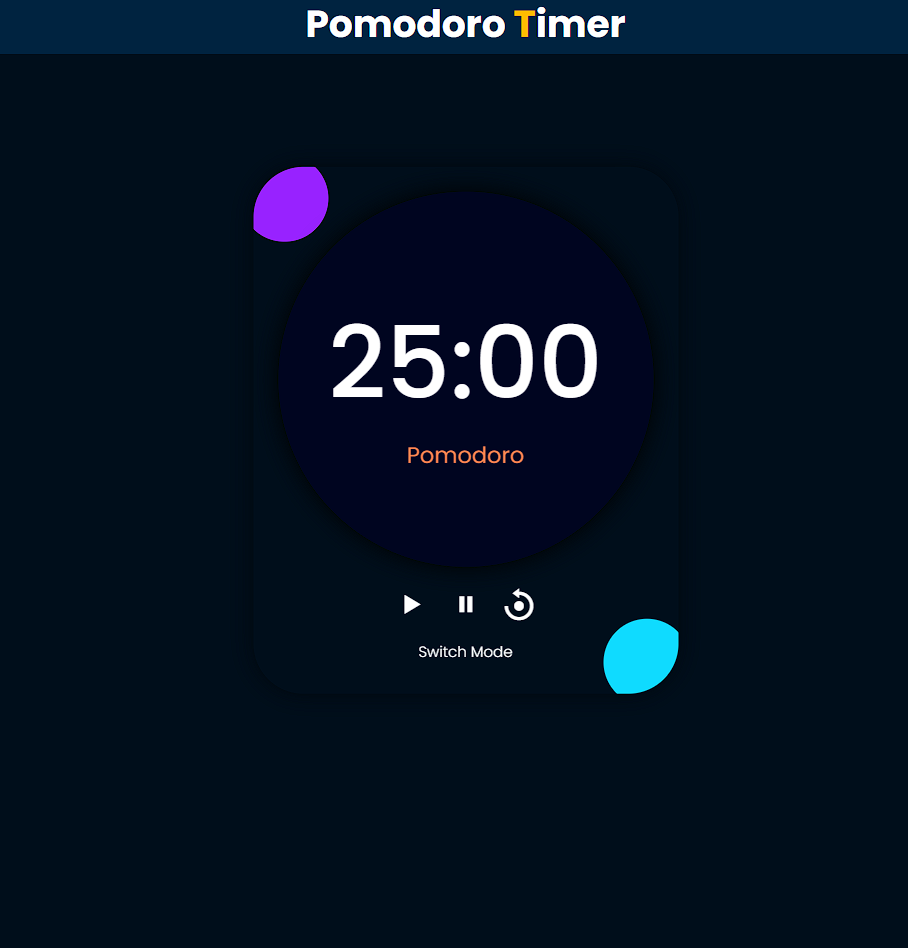

# Pomodoro Timer

## Overview
The Pomodoro Timer is a productivity tool that helps you manage your time effectively using the Pomodoro Technique. It allows you to focus on tasks for a set period followed by short breaks, ensuring maximum productivity while avoiding burnout.

## Features
- Set customizable timer for work sessions and breaks
- Switch between Pomodoro mode and break mode
- Start, pause, and reset timer functionality
- Visual indication of current mode (Pomodoro or Break)
- Responsive design for seamless use across devices
- Notification sound when timer reaches the last 3 seconds
- Browser tab title updated with the remaining time
- Responsive design for seamless use across devices

## How to Use
1. Clone the repository to your local machine.
2. Open the `index.html` file in your web browser.
3. Start the timer by clicking the play button.
4. Pause the timer anytime using the pause button.
5. Reset the timer to its initial state using the reset button.
6. Switch between Pomodoro and Break modes using the switch mode button.
7. Optionally, set custom durations for short and long breaks.

## Technologies Used
- HTML5
- CSS3
- JavaScript

## Responsive Design
The Pomodoro Timer is designed to be responsive and works well on various devices. The layout adjusts appropriately for different screen sizes:
- **1024px and below:** Adjustments for tablets and medium-sized screens.
- **768px and below:** Adjustments for small tablets and large smartphones.
- **425px and below:** Adjustments for most smartphones.
- **375px and below:** Further adjustments for smaller smartphones.
- **320px and below:** Optimized for the smallest smartphone screens.

## Preview

## How to Contribute
1. Fork the repository.
2. Create your feature branch (`git checkout -b feature/YourFeatureName`).
3. Commit your changes (`git commit -am 'Add some feature'`).
4. Push to the branch (`git push origin feature/YourFeatureName`).
5. Create a new Pull Request.

## Credits
- Icons provided by [Boxicons](https://boxicons.com/)

